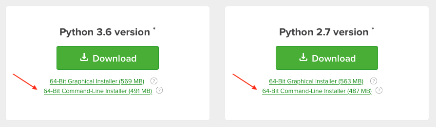

# Python

## Motivation

**Why Python?** Python has gone from a niche in astronomy to the dominent language of choice. While other languages are certainly used (C/C++, IDL, Fortran, ... and that’s about it), [Python is the easily the main choice for new software](https://arxiv.org/abs/1507.03989), and will be increasingly so for the foreseeable future.

Your should expect your students to be not just familiar with but proficient in Python, and as early in their career as possible. If you don’t feel like you have the time to learn to write Python yourself, you should at least become reasonably comfortable reading it.

## Python 2 vs. Python 3

There are two major versions of Python at the moment – version 2 and version 3. There are not entirely compatible with one another; Python 3 introduced new features and does some things differently enough that Python 2 code won't run directly in the new version. However, the good news is that most of the changes are the addition of new features, and the number of incompatible differences are relatively minor. It’s reasonably straightforward to convert Python 2 scripts to Python 3.

Python 2.7 was released in July 2010 and is the last najor release of Python 2. It will be “retired” in 2020, which means it will no longer be supported. *All new Python code should be written in Python 3.* Of course, there are many existing scripts that have been written in Python 2 and have not been converted, so you should have an installation of both Python 2 and Python 3 on your computer, where Python 3 is the default. The next section will walk you through the steps to do this.

Lest you become concerned that your will have to convert your Python scripts soon, note that there is no discussion anywhere about a Python 4.

## Installing Python

All installations of macOS and (virtually all) Linux systems have Python built in; you can test this simply by typing `python` on the command line to start the interactive interpreter. You’ll see something like this:

```
% python
Python 2.7.10 (default, Jul 15 2017, 17:16:57) 
[GCC 4.2.1 Compatible Apple LLVM 9.0.0 (clang-900.0.31)] on darwin
Type "help", "copyright", "credits" or "license" for more information.
>>> print("hello world")
hello world
>>> 
```

You should not use this Python. Through the course of development you will install additional Python libraries and customize it to your needs. The operating system (and other programs) depend on Python and expect a particular version - if something goes wrong, things like system updates might break and you will have to reinstall your whole operating system. Best to be safe. Further, as of this writing it's still common to find Python 2 (as above) installed by default with the operating system, and we want Python 3.

We will install our own, separate Python on our system. In fact, we'll install two – Python 2 (for the times we may need it) and Python 3. Luckily, we don't have to install this from source. There are a few companies that packge Python plus a large number of libraries together into a single installation; we will use one from a company called [Anaconda](https://www.anaconda.com). This distribution is also called Anaconda, so you may hear people talk about the “Anaconda Python distribution”. It’s regular Python, but prepackaged (plus other features we’ll discuss later).

### Download the Anaconda Installer

You can download the installer from [https://www.anaconda.com/download](https://www.anaconda.com/download). You’ll see an option for both the 2.x and 3.x versions, and (depending on your platform) a choice between the command line installer and the graphical installer. We want to download both the 2.x and 3.x command line installers (yes, even if you are on a Mac!).



The downloaded file will have a name like `Anaconda3-5.0.1-MacOSX-x86_64.sh`.

### Installation

Open a terminal program (e.g. `/Applications/Utilities/Terminal` on the Mac), and change to the directory to where you downloaded the file. You will have the option to install Python anywhere you like; here are two recommendations.

 1. If you want to install Python so that any user on your computer can use it, install in `/usr/local/anaconda`.
 2. If you want to install it just for yourself, you can use `~/anaconda`. This option is useful if you want to install Anaconda on a server where you do not have root access: you can simply install your own copy.

If you are choosing option (1), you need to use `sudo` to install:

```
% sudo bash Anaconda3-5.0.1-MacOSX-x86_64.sh
```

If you are installing it anywhere you have write permission, then you can drop the `sudo`:

```
% bash Anaconda3-5.0.1-MacOSX-x86_64.sh
```

After accepting the license terms, you will see this:

```
Anaconda3 will now be installed into this location:
/Users/demitri/anaconda3

  - Press ENTER to confirm the location
  - Press CTRL-C to abort the installation
  - Or specify a different location below

[/Users/demitri/anaconda3] >>>
```

We want to consider Python 3 our default Python, so change this to either (1) `/usr/local/anaconda` or (2) `~/anaconda` and hit return. It will take a few minutes.

Next, we'll install Python 2. The procedure is exactly the same, but select the path `/usr/local/anaconda2` or `~/anaconda2`, depending on where you want to install it.

(Of course, you can name and place these directories anywhere you want.)

### Setting Your Path

If you followed all of the steps above, you now have *three* installations pf Python on your computer - the one that came with the system, Anaconda Python 3, and Anaconda Python 2. Which one is called when you type `python` on the command line?

This is determined by your `$PATH` environment variable, which is a list of directory locations on your computer separated by colons. It will look something like this: 

```
% echo $PATH
/usr/local/bin:/usr/bin:/bin:/usr/sbin:/sbin:/opt/X11/bin
```

When you type any command in the terminal (e.g. `ls`), the shell looks for a program it can run with that name in the first directory in `$PATH`, then the next, and so on until it finds it. This means the order of the directories is important.

On a clean system install, the first `python` found will be in `/usr/bin/python`, i.e. the pre-installed version. We want to change this to use our newly installed Python 3, so we will add that directory to the *beginning* of `$PATH`, like this:

```
export PATH=/usr/local/anaconda/bin:$PATH
```

A few things are happening here:

* We are redefining the `$PATH` variable.
* We set the path we installed Python into as the first item. Note that `/bin` is added to the path; that’s actually where the executable is.
* We then add the previous definition of `$PATH`.

It now looks like this (yours might look a little different; that's ok):

```
% echo $PATH
/usr/local/anaconda/bin:/usr/local/bin:/usr/bin:/bin:/usr/sbin:/sbin:/opt/X11/bin
```
Now if you type `python`, you should see Python 3 starting. This will only be effective in the terminal session you have open. To apply this to all future sessions, copy the `export ...` command above as the last line of the file `~/.bashrc` (Linux) or `~/.bash_profile` (Mac).

What about Python 2? Rather than modify the path for that, let’s create an alias, again putting this line in the same file as above.

```
alias python2="/usr/local/anaconda2/bin/python"
```

You would then run a Python 2.x script with:

```
% python2 script_name.py
```

More detail on how to run scripts follows below.

## Coming To Python From IDL

People coming from IDL feel comfortable using Python in the same way; typing `python` at the prompt and working in the interactive enviroment. In IDL, one commonly runs scripts from the interactive prompt, e.g.

```
IDL> .run script_name
```

It’s possible to use Python in a similar manner, but you shouldn’t. Python is designed differently than IDL. You should think in terms of Python scripts as standalone programs which you run directly on the command line, not in the interactive environment. Certainly you can use the interactive environment, but use it to test code or debug, not run programs from.


## Installing Python Packages

### pip

The Python language can be extended by installing specialized packages (also known as modules) that have been written by other poeople. While you can install these from source code, Python comes with a program called `pip` that can install packages for you.

You can install a new package if you know its now its name from the command line, for example, to install Astropy:

```
pip install astropy
```

What is nice about `pip` is that if `astropy` had any external depedencies, it will install them too. More complicated packages  that might include C or FORTRAN are also compiled and set up.

You can search for new packages here: [PyPI (the Python Package Index)](http://pypi.python.org). You don't need to download anything from this site - just use the name and install with `pip` as above.

### conda Package Manager

One of the advantages to installing the Anaconda distribution is that it comes with its own manager to install packages called `conda`. It can be used to install or update individual packages, or to update your installation all at once.

To install a single package:

`conda install astropy`

To update your installation:

`conda update anaconda`

To update `conda` itself:

`conda update conda`

You are not required to use the package manager– you can still install packages yourself or via `pip` (which you'll need to do if the package you’re interested in isn't available from Anaconda).

Remember to prepend the commands above with `sudo` if your installation was placed in location you don't have automatic write access to.
